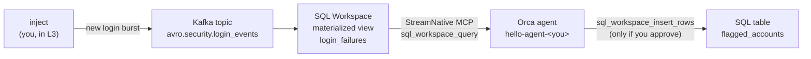

# Data + Agent Hackathon: hello world

**Data Streaming Summit 2026 · guided tutorial · about 30 minutes**

In the next half hour you'll build an agent whose context is a live Kafka stream,
kept fresh by streaming SQL, and that asks a human before it acts. Four short
layers, each adding one idea. The agent steps work three ways; pick one:

- **CLI**: the [`ork`](https://github.com/orca-ae/orca-cli) command line
- **Python**: the [`runorca`](https://pypi.org/project/runorca/) SDK
- **TypeScript**: the [`@runorca/orca-sdk`](https://www.npmjs.com/package/@runorca/orca-sdk) SDK

## The story

Aegis Financial, a fictional bank, streams every login attempt into Kafka.
Somewhere in that stream, an attacker is guessing passwords. Your agent will spot
them from live data, and flag the account once you say so.



| Step | Time | Where | You | The idea |
|---|---|---|---|---|
| [0. Connect](#step-0-connect-3-min) | 3 min | terminal | Fill in `.env`, run the doctor | One key, checked end to end |
| [L1. Hello, agent](#l1-hello-agent-5-min) | 5 min | CLI / Python / TS | Create an agent and chat | Agent, environment, session, events |
| [L2. Hello, streaming SQL](#l2-hello-streaming-sql-8-min) | 8 min | SQL Workspace | Build a materialized view over the topic | Context that keeps itself fresh |
| [L3. Agent + live context](#l3-agent--live-context-9-min) | 9 min | CLI / Python / TS | Give the agent SQL tools, inject new data | The answer changes with the data |
| [L4. Agent acts, human approves](#l4-agent-acts-human-approves-5-min) | 5 min | CLI / Python / TS | Let the agent write, with your OK | Governed actions |

## Before you start

- Your **team card** from the organizers. Your team's Kafka cluster already
  holds the login stream.
- One path installed: see [Before you arrive](docs/before-you-arrive.md).

## Step 0: Connect (3 min)

Copy the template, then paste the values from your team card into `.env`:

```bash
cp .env.example .env
```

Go to your path's folder and run the doctor:

| Path | Run |
|---|---|
| Python | `cd python && source .venv/bin/activate && python doctor.py` |
| TypeScript | `cd typescript && npm run doctor` |
| CLI | `cd cli`, and run the doctor from your helper language: `(cd ../python && .venv/bin/python doctor.py)` or `(cd ../typescript && npm run doctor)` |

Every line should say `PASS`. A failed check prints its fix. Still stuck after
two tries? Raise your hand.

## L1: Hello, agent (5 min)

| CLI | Python | TypeScript |
|---|---|---|
| `./l1_hello.sh` | `python l1_hello.py` | `npm run l1` |

You'll see something like this (the agent's wording varies):

```
hello-agent-ana v1: no tools: just a conversation
[you]    Hi! What is the Data + Agent Hackathon, and what can you see right now?
[agent]  It's a one-day build where teams combine live streaming data with AI agents. I can't see any live data yet: the next step connects me to a Kafka stream.
```

**What just happened: four API calls.**

1. **Environment**: where your agent's sessions run.
2. **Agent**: a model plus a system prompt, defined in
   [`agent/l1-hello.json`](agent/l1-hello.json). All three paths read that file.
3. **Session**: one conversation, pinned to a specific agent version.
4. **Events**: you send a `user.message`; the agent streams back `agent.message`
   events until the session goes idle.

<details>
<summary>The code (Python)</summary>

```python
environment_id = ensure_environment(client, state, f"hello-env-{config.participant}")

layer = load_layer("l1-hello")
agent = ensure_agent(client, state, agent_params(layer, config))

session = client.sessions.create(
    environment_id=environment_id,
    agent={"type": "agent", "id": agent.id, "version": agent.version},
    title="L1: hello",
)
run_turn(client, session.id, question)
```

`run_turn` ([`python/common.py`](python/common.py)) opens the event stream
*before* sending the message, so no event is missed, then prints events until
the agent's turn ends.
</details>

<details>
<summary>The code (TypeScript)</summary>

```ts
const environmentId = await ensureEnvironment(client, state, `hello-env-${config.participant}`);

const layer = loadLayer('l1-hello');
const agent = await ensureAgent(client, state, agentParams(layer, config));

const session = await client.sessions.create({
  environment_id: environmentId,
  agent: { type: 'agent', id: agent.id, version: agent.version },
  title: 'L1: hello',
});
await runTurn(client, session.id, question);
```

`runTurn` ([`typescript/src/common.ts`](typescript/src/common.ts)) works the same
way as the Python version.
</details>

<details>
<summary>The commands (CLI)</summary>

```bash
ork agent environments create --name hello-env-ana -o json

ork agent create --name hello-agent-ana --model "$ORCA_MODEL" \
  --system "$(jq -r .system ../agent/l1-hello.json)" -o json

ork agent sessions create --agent "$AGENT_ID" --agent-version 1 \
  --environment-id "$ENVIRONMENT_ID" --title "L1: hello" -o json

ork agent sessions events send message --session "$SESSION_ID" --text "Hi! ..."
ork agent sessions events stream --session "$SESSION_ID" --timeout 15s
```

[`cli/lib.sh`](cli/lib.sh) wraps these commands, remembers the ids, and prints
the stream the same way as the other paths.
</details>

Re-running is safe: the scripts remember your agent in `.orca-state/` and only
create a new version when its definition changes.

## L2: Hello, streaming SQL (8 min)

In the StreamNative Cloud console, open **SQL Workspace**, select the hackathon
workspace, and pick your team's database. Use a new query tab for each step.

**1. Peek at the stream** ([`sql/01_explore.sql`](sql/01_explore.sql)). Each row
is one login attempt. The topic name contains dots, so it's double-quoted.

```sql
SELECT event_time, account_id, ip_address, result, failure_reason
FROM "avro.security.login_events"
ORDER BY event_time DESC
LIMIT 20;
```

**2. Turn the stream into context** ([`sql/02_login_failures.sql`](sql/02_login_failures.sql)).

```sql
CREATE MATERIALIZED VIEW login_failures AS
SELECT
  account_id,
  COUNT(*) FILTER (WHERE result = 'FAILURE') AS failed_logins,
  COUNT(*) FILTER (WHERE result = 'SUCCESS') AS successful_logins,
  COUNT(DISTINCT ip_address)                AS distinct_ips,
  MAX(event_time)                           AS last_seen
FROM "avro.security.login_events"
GROUP BY account_id;
```

A materialized view is maintained incrementally: every new login updates the
counts within seconds. There is no batch job to schedule and nothing to refresh.
That makes it perfect agent context: always current, and cheap to read.

Check it: `SELECT * FROM login_failures ORDER BY failed_logins DESC LIMIT 10;`
You should see `acct_0042` near the top: failed logins, then a success. That's
the attacker.

**3. Make room for the agent's decisions** ([`sql/03_flagged_accounts.sql`](sql/03_flagged_accounts.sql)).
The agent will write here in L4.

```sql
CREATE TABLE flagged_accounts (
  account_id VARCHAR PRIMARY KEY,
  reason     VARCHAR,
  flagged_at TIMESTAMPTZ DEFAULT now()
);
```

## L3: Agent + live context (9 min)

| CLI | Python | TypeScript |
|---|---|---|
| `./l3_live_context.sh` | `python l3_live_context.py` | `npm run l3` |

Your agent is now at version 2, and answers *"Which accounts look like an account
takeover right now?"* by querying `login_failures` itself. The `[tool]` lines
show the SQL it runs:

```
hello-agent-ana v2: + StreamNative MCP (read-only SQL tools)
[you]    Which accounts look like an account takeover right now?
[tool]   sql_workspace_list_databases {}
[tool]   sql_workspace_query {"database": "...", "sql": "SELECT account_id, failed_logins, ..."}
[agent]  acct_0042: 5 failed logins followed by a success, from 2 IP addresses ...
```

**Now the real-time moment.** Leave the conversation open. In a **second
terminal**, inject a fresh attack:

| Python (and CLI path) | TypeScript (and CLI path) |
|---|---|
| `cd python && source .venv/bin/activate && python inject.py` | `cd typescript && npm run inject` |

It prints the account it attacked, `acct_9…`. Back in the first terminal, ask the
same question again. The new account shows up. Nobody refreshed anything: the
event landed in Kafka, the view updated itself, and the agent read the view.

**What changed** ([`agent/l3-live-context.json`](agent/l3-live-context.json)):

- `mcp_servers`: the StreamNative MCP server for your SQL Workspace.
- `tools`: an allow-list. Two read-only tools run without asking
  (`always_allow`); every other tool on that server is disabled.
- A **vault**: the MCP server's credential (your team key) is stored server-side.
  The session references the vault by id, so the key never enters the prompt.

<details>
<summary>The code (Python)</summary>

```python
layer = load_layer("l3-live-context")
agent = ensure_agent(client, state, agent_params(layer, config))

vault_id = ensure_vault(client, state, f"hello-vault-{config.participant}", config["SN_MCP_URL"], config["SN_API_KEY"])
session = client.sessions.create(
    environment_id=environment_id,
    agent={"type": "agent", "id": agent.id, "version": agent.version},
    vault_ids=[vault_id],
    title="L3: live context",
)
chat(client, session.id, QUESTION)
```
</details>

<details>
<summary>The code (TypeScript)</summary>

```ts
const layer = loadLayer('l3-live-context');
const agent = await ensureAgent(client, state, agentParams(layer, config));

const vaultId = await ensureVault(client, state, `hello-vault-${config.participant}`, config.get('SN_MCP_URL'), config.get('SN_API_KEY'));
const session = await client.sessions.create({
  environment_id: environmentId,
  agent: { type: 'agent', id: agent.id, version: agent.version },
  vault_ids: [vaultId],
  title: 'L3: live context',
});
await chat(client, session.id, QUESTION);
```
</details>

<details>
<summary>The commands (CLI)</summary>

```bash
ork agent update "$AGENT_ID" --version 1 --model "$ORCA_MODEL" \
  --system "$(jq -r .system ../agent/l3-live-context.json)" \
  --mcp-server "name=streamnative,type=url,url=$SN_MCP_URL" \
  --tool-json "$(jq -c '.tools[0]' ../agent/l3-live-context.json)" -o json

ork agent vaults create --display-name hello-vault-ana -o json
ork agent vaults credentials create --vault "$VAULT_ID" --display-name streamnative-mcp \
  --auth-json '{"type":"static_bearer","mcp_server_url":"<SN_MCP_URL>","token":"<SN_API_KEY>"}'

ork agent sessions create --agent "$AGENT_ID" --agent-version 2 \
  --environment-id "$ENVIRONMENT_ID" --vault-id "$VAULT_ID" --title "L3: live context" -o json
```
</details>

## L4: Agent acts, human approves (5 min)

| CLI | Python | TypeScript |
|---|---|---|
| `./l4_act.sh` | `python l4_act.py` | `npm run l4` |

The agent (version 3) gets one write tool, and it can only use it with your
approval. It queries the view, then proposes an insert, and the session pauses:

```
[approve?] The agent wants to run sql_workspace_insert_rows with:
{
  "table": "flagged_accounts",
  "rows": [{"account_id": "acct_9…", "reason": "6 failed logins then a success from one new IP"}]
}
Allow it? [y/N]
```

Type `y`, then check in SQL Workspace:

```sql
SELECT * FROM flagged_accounts;
```

Ask again, and answer `n` this time. The agent is told a human denied the insert,
and it does not retry.

**What changed** ([`agent/l4-act.json`](agent/l4-act.json)): one more tool,
`sql_workspace_insert_rows`, with `permission_policy: always_ask`. When the agent
calls it, the session emits `agent.mcp_tool_use` and goes idle with
`stop_reason: requires_action`. Your script answers with a
`user.tool_confirmation`: `allow`, or `deny` with a reason. On the CLI that is:

```bash
ork agent sessions events send tool-confirmation --session "$SESSION_ID" \
  --tool-use-id "$TOOL_USE_EVENT_ID" --decision allow
```

## What you just built

- **A stream** (Kafka) that holds the facts as they happen.
- **A materialized view** that keeps a running summary: the agent's always-fresh context.
- **An agent** that reads that context itself, through an allow-list of tools.
- **A human approval gate** on the one action that changes something.

That's the shape of most data + agent apps. Swap the topic, the view, and the
action, and you have your hackathon project. Ideas and next steps:
[Go further](docs/go-further.md).

## Troubleshooting

| Symptom | Fix |
|---|---|
| Doctor: `Agent Engine HTTP 401/403` | The key was rejected. A key created before its permissions must be re-created: ask a facilitator. |
| Doctor: `Kafka ... authentication` | `SN_SERVICE_ACCOUNT` must be the full principal, `<name>@<org>.auth.streamnative.cloud`; `SN_API_KEY` is the raw key. |
| The login topic isn't listed in SQL Workspace | Only topics with a registered Avro schema appear. Ask a facilitator. |
| `relation "avro.security.login_events" does not exist` | Select your team's database, and keep the double quotes around the name. |
| The agent can't find `login_failures` | Create the view in your team's database (L2, step 2); the agent looks it up there. |
| `[error]` lines from MCP tools in L3 | Check `SN_MCP_URL` against your team card, then rerun the doctor. |
| `Cannot reach the Agent Engine` | `ORCA_BASE_URL` must be the host root from your card, with no `/v1`. |
| The agent answers from memory instead of querying | Ask again, "check the view first". The system prompt tells it to always query. |

## Clean up

| CLI | Python | TypeScript |
|---|---|---|
| `./cleanup.sh` | `python cleanup.py` | `npm run cleanup` |

This archives your agent and deletes your vault and environment. To start L2
over, run [`sql/99_reset.sql`](sql/99_reset.sql).

## What's in this repository

| Path | What |
|---|---|
| [`agent/`](agent) | The agent definition for each layer, shared by all three paths |
| [`sql/`](sql) | The SQL for L2, plus a reset script |
| [`cli/`](cli) | The CLI path (`ork` + `jq`) |
| [`python/`](python) | The Python path, the doctor, and the data injector |
| [`typescript/`](typescript) | The TypeScript path, the doctor, and the data injector |
| [`schemas/`](schemas) | The Avro schema of the login topic |
| [`docs/`](docs) | [Before you arrive](docs/before-you-arrive.md) · [Go further](docs/go-further.md) |

Licensed under [Apache 2.0](LICENSE).
