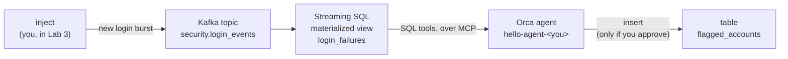

# Data + Agent Hackathon: hello world

**Data Streaming Summit 2026 · a hands-on course in five short labs**

You build an agent whose context is a live Kafka stream, kept fresh by streaming
SQL, and that asks a human before it acts. Five labs, each adding one idea.

## The story

Aegis Financial, a fictional bank, streams every login attempt into Kafka.
Somewhere in that stream, an attacker is guessing passwords. Your agent spots
them from live data, and flags the account once you say so.

## Pick your course

The same five labs, on two stacks.

| | [Cloud course](labs/cloud/README.md) | [Local course](labs/local/README.md) |
|---|---|---|
| Runs on | StreamNative Cloud: your own instance, with a Kafka cluster, a SQL workspace, and an agent workspace | Your laptop: [Ursa for Kafka](https://openlakestream.org/docs/ursa-for-kafka), [RisingWave](https://risingwave.com), and the Orca Agent Engine (`ork local`) |
| You need | A StreamNative Cloud login from the hackathon organizers, with a team environment they created or an instance of your own | Docker and an Anthropic API key |
| Time | About 40 minutes | About 45 minutes, plus image downloads |
| Start | [Lab 0: Set up](labs/cloud/00-set-up.md), or [from a team card](labs/cloud/00-set-up-team-card.md) | [Lab 0: Set up](labs/local/00-set-up.md) |

At the hackathon, take the Cloud course: see
[Before you arrive](docs/before-you-arrive.md). Without a StreamNative Cloud
instance, or to see every part run on your own machine, take the Local course.

## Pick your path

The agent steps work three ways. Pick one.

- **CLI**: the [`ork`](https://github.com/orca-ae/orca-cli) command line
- **Python**: the [`runorca`](https://pypi.org/project/runorca/) SDK
- **TypeScript**: the [`@runorca/orca-sdk`](https://www.npmjs.com/package/@runorca/orca-sdk) SDK

## The labs

| Lab | You | The idea |
|---|---|---|
| 0. Set up | Get your stack ready and run the doctor | Know that every part answers before you build on it |
| 1. Hello, agent | Create an agent and chat | Agent, environment, session, events |
| 2. Hello, streaming SQL | Build a materialized view over the topic | Context that keeps itself fresh |
| 3. Agent + live context | Give the agent SQL tools, inject new data | The answer changes with the data |
| 4. Agent acts, human approves | Let the agent write, with your OK | Governed actions |

Every lab is steps you can check, a short quiz, and a task to try on your own.
[The labs](labs/README.md) explains how a lab and its checks work.

## Learn with a tutor

A coding agent such as Claude Code can walk you through either course one step
at a time, check your work with you, and quiz you. The tutor skill ships in this
repository: see [Learn with the tutor](docs/tutor.md).

## What you build

- **A stream** (Kafka) that holds the facts as they happen.
- **A materialized view** that keeps a running summary: the agent's always-fresh
  context.
- **An agent** that reads that context itself, through an allow-list of tools.
- **A human approval gate** on the one action that changes something.

That is the shape of most data + agent applications. Swap the topic, the view,
and the action, and you have your own project: [Go further](docs/go-further.md).

## What's in this repository

| Path | What |
|---|---|
| [`labs/`](labs) | The two courses: [Cloud](labs/cloud/README.md) and [Local](labs/local/README.md) |
| [`agent/`](agent) | The agent definition for each lab, per stack, shared by all three paths |
| [`sql/`](sql) | The SQL for Lab 2, per stack, plus a reset script |
| [`cli/`](cli) | The CLI path (`ork` + `jq`) |
| [`python/`](python) | The Python path, the doctor, the seeder, and the data injector |
| [`typescript/`](typescript) | The TypeScript path, the doctor, the seeder, and the data injector |
| [`local/`](local) | The Local course's stack: a Compose file and four helper scripts |
| [`lab-ork`](lab-ork) | `ork` with your endpoint, key, and ids filled in: what the lab checks use |
| [`data/`](data), [`schemas/`](schemas) | The synthetic login events the Local course loads, and their Avro schema |
| [`skills/`](skills) | The tutor skill |
| [`docs/`](docs) | [Before you arrive](docs/before-you-arrive.md) · [Learn with the tutor](docs/tutor.md) · [Go further](docs/go-further.md) |

Licensed under [Apache 2.0](LICENSE).
