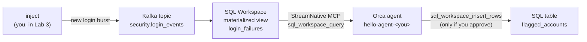

# Cloud course

**Data + Agent Hackathon: hello world, on StreamNative Cloud · about 40 minutes**

You build an agent whose context is a live Kafka stream, kept fresh by streaming
SQL, and that asks a human before it acts. Everything runs in your own instance
on StreamNative Cloud.

## The story

Aegis Financial, a fictional bank, streams every login attempt into Kafka.
Somewhere in that stream, an attacker is guessing passwords. Your agent spots
them from live data, and flags the account once you say so.

## The labs

| Lab | Time | Where | You | The idea |
|---|---|---|---|---|
| [0. Set up](00-set-up.md) | 10 min | terminal | Fill in `.env` from your instance, load the topic, run the doctor | Check service access before you build on it |
| or [0. Set up from a team card](00-set-up-team-card.md) | 5 min | terminal | Fill in `.env` from your team card, load the topic, run the doctor | The same, when the organizers created your environment |
| [1. Hello, agent](01-hello-agent.md) | 5 min | CLI / Python / TS | Create an agent and chat | Agent, environment, session, events |
| [2. Hello, streaming SQL](02-streaming-sql.md) | 8 min | SQL Workspace | Build a materialized view over the topic | Context that keeps itself fresh |
| [3. Agent + live context](03-live-context.md) | 9 min | CLI / Python / TS | Give the agent SQL tools, inject new data | The answer changes with the data |
| [4. Agent acts, human approves](04-act-with-approval.md) | 5 min | CLI / Python / TS | Let the agent write, with your OK | Governed actions |

The times are for the steps. Each lab also has a short quiz and a task to try on
your own.

## What you need

- A login to StreamNative Cloud, in the hackathon organization, with an
  **instance** of your own and a **service account** in it (its name and API
  key). The organizers set these up.
- In your instance, a **Kafka cluster**, an **agent workspace**, and a **SQL
  workspace** that imports the Kafka cluster.
- One path installed, plus `ork`, `jq`, and `snctl`. All of this is in
  [Before you arrive](../../docs/before-you-arrive.md).

**Have a team card?** Then the organizers created all of this for your team,
and the card has its addresses and an API key. You need only your login, one
path, `ork`, and `jq`, and you start with
[Lab 0: Set up from a team card](00-set-up-team-card.md).

Otherwise, start with [Lab 0: Set up](00-set-up.md). If something goes wrong,
see [Troubleshooting](troubleshooting.md). How labs and checks work is in
[The labs](../README.md), and a coding agent can
[tutor you through the course](../../docs/tutor.md).

No StreamNative Cloud instance? Take the [Local course](../local/README.md):
the same labs, on your laptop.

## What was run

These pages were rewritten on 2 October 2026 and run against one test instance
on StreamNative Cloud that night, with `snctl` 1.8.0 and `ork` 0.6.0. The Kafka
cluster was Serverless; the SQL workspace ran RisingWave 3.1.0-alpha.

- **Lab 0**: every `snctl` lookup, the topic, the seeder, and the doctor, on the
  Python path. On the TypeScript path, the doctor, and the seeder against the
  topic once it was loaded.
- **Lab 0 from a team card**: added on 6 October 2026 and run that day against
  the same test instance, from a card of ready-made `NAME=value` lines. On the
  Python path: every step and check, and the failing doctor run its solution
  shows. On the TypeScript path, and with the CLI column's commands: the doctor
  and the seeder. The topic was loaded already (274 events, after earlier Lab 3
  runs), so the seeder printed its "already holds" line each time. The card had
  no `SN_SQL_DATABASE` line; nothing in Lab 0 reads that value. Not run from
  this page: the seeder on an empty topic, a card of labeled values, and an
  environment the organizers created.
- **Lab 2**: every statement and check, through `psql`. The console was not
  used.
- **Labs 1, 3 and 4**: every step and check, on all three paths, with the model
  answering: the injected account showing up, one insert approved and one
  denied. On the CLI path the first Lab 4 run gave up after five minutes: the
  Agent Engine acted on the approval eight minutes after it was given. The
  second run passed.
- **Not run on this course**: the "Try it yourself" tasks, which were run on
  the Local course, and the clean-up at the end of Lab 4.
