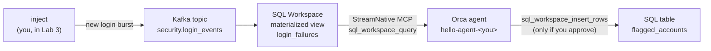

# Cloud course

**Data + Agent Hackathon: hello world, on StreamNative Cloud · about 30 minutes**

You build an agent whose context is a live Kafka stream, kept fresh by streaming
SQL, and that asks a human before it acts. Everything runs on the environment on
your team card.

## The story

Aegis Financial, a fictional bank, streams every login attempt into Kafka.
Somewhere in that stream, an attacker is guessing passwords. Your agent spots
them from live data, and flags the account once you say so.

## The labs

| Lab | Time | Where | You | The idea |
|---|---|---|---|---|
| [0. Set up](00-set-up.md) | 3 min | terminal | Fill in `.env`, run the doctor | Check service access before you build on it |
| [1. Hello, agent](01-hello-agent.md) | 5 min | CLI / Python / TS | Create an agent and chat | Agent, environment, session, events |
| [2. Hello, streaming SQL](02-streaming-sql.md) | 8 min | SQL Workspace | Build a materialized view over the topic | Context that keeps itself fresh |
| [3. Agent + live context](03-live-context.md) | 9 min | CLI / Python / TS | Give the agent SQL tools, inject new data | The answer changes with the data |
| [4. Agent acts, human approves](04-act-with-approval.md) | 5 min | CLI / Python / TS | Let the agent write, with your OK | Governed actions |

The times are for the steps. Each lab also has a short quiz and a task to try on
your own.

## What you need

- Your **team card** from the organizers. Your team's Kafka cluster already
  holds the login stream.
- One path installed, plus `ork` and `jq`: see
  [Before you arrive](../../docs/before-you-arrive.md).

Start with [Lab 0: Set up](00-set-up.md). If something goes wrong, see
[Troubleshooting](troubleshooting.md). How labs and checks work is in
[The labs](../README.md), and a coding agent can
[tutor you through the course](../../docs/tutor.md).

No team card? Take the [Local course](../local/README.md): the same labs, on
your laptop.

## What was run

These pages were rewritten on 2 October 2026, and the checks were added then.

- **Run, on the Agent Engine of the [Local course](../local/README.md)** (`ork`
  0.6.0, which serves the same API): the check commands of Labs 1, 3 and 4 that
  read your agent, its versions, its tools and their policies, and its sessions.
- **Not run for this revision: anything that needs a team card.** That is the
  doctor against StreamNative Cloud, SQL Workspace (Lab 2), the browser login
  and the vault (Lab 3), the hosted SQL tools (Labs 3 and 4), and every step
  where the model answers. For those steps the labs show what the scripts are
  written to print and what the checks are written to select, not a recording of
  a run.
