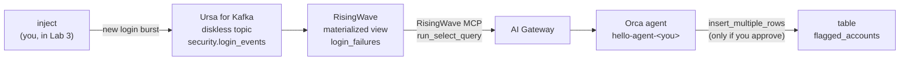

# Local course

**Data + Agent Hackathon: hello world, on your laptop · about 45 minutes, plus image downloads**

You build an agent whose context is a live Kafka stream, kept fresh by streaming
SQL, and that asks a human before it acts. Every part runs on your machine. No
account, no team card.

## The story

Aegis Financial, a fictional bank, streams every login attempt into Kafka.
Somewhere in that stream, an attacker is guessing passwords. Your agent spots
them from live data, and flags the account once you say so.

## What runs on your laptop

| Part | What it is | Started by |
|---|---|---|
| [Ursa for Kafka](https://openlakestream.org/docs/ursa-for-kafka) | Kafka, with a diskless login topic: its records live in an object store, not on the broker | `docker compose -f local/compose.yaml up` |
| Oxia, object store, schema registry | What a diskless topic and Avro need | the same command |
| [RisingWave](https://risingwave.com) | Streaming SQL: the materialized view | the same command |
| RisingWave MCP server | The agent's SQL tools | the same command |
| Orca Agent Engine | Runs your agent: registry, harness, and AI Gateway | `local/engine.sh`, which runs `ork local` |

## The labs

| Lab | Time | Where | You | The idea |
|---|---|---|---|---|
| [0. Set up](00-set-up.md) | 15 min | terminal | Start both stacks, load the login stream, run the doctor | Know that every part answers before you build on it |
| [1. Hello, agent](01-hello-agent.md) | 5 min | CLI / Python / TS | Create an agent and chat | Agent, environment, session, events |
| [2. Hello, streaming SQL](02-streaming-sql.md) | 8 min | `psql` | Connect RisingWave to the topic and build a materialized view | Context that keeps itself fresh |
| [3. Agent + live context](03-live-context.md) | 9 min | CLI / Python / TS | Give the agent a SQL tool, inject new data | The answer changes with the data |
| [4. Agent acts, human approves](04-act-with-approval.md) | 5 min | CLI / Python / TS | Let the agent write, with your OK | Governed actions |

The times are for the steps. Each lab also has a short quiz and a task to try on
your own.

## What you need

- **Docker** with Compose v2 (Docker Desktop, or Docker Engine on Linux). The
  images are a 5 GB download and take about 20 GB of disk once unpacked; more
  than half of that is RisingWave. Running, the two stacks use about 2.5 GB of
  memory.
- **An Anthropic API key**, from the Anthropic Console, on an account with
  credit. The agent answers six questions in the whole course, plus the ones you
  ask on your own; see "What was run" below for what that cost.
- [`ork`](https://github.com/orca-ae/orca-cli) v0.6.0 or newer, and
  [`jq`](https://jqlang.org/download/).
- One path: Python 3.11 or newer, or Node.js 20 or newer. The CLI path also
  uses one of them for the doctor, the seeder, and the injector.
- macOS or Linux. On Windows, use WSL 2.

Start with [Lab 0: Set up](00-set-up.md). If something goes wrong, see
[Troubleshooting](troubleshooting.md). How labs and checks work is in
[The labs](../README.md), and a coding agent can
[tutor you through the course](../../docs/tutor.md).

Have a team card from the hackathon? Take the [Cloud course](../cloud/README.md)
instead: the same labs, on StreamNative Cloud.

## What was run

This course was run on 2 October 2026 on macOS 26 (Apple silicon) with Docker
29.2 and Compose 5.1, from a fresh `local/down.sh --reset` on each path:

| Part | Version |
|---|---|
| `ork` | 0.6.0 (Agent Engine 0.5.1, AI Gateway 0.4.3) |
| Ursa for Kafka | `lakestream/kafka:4.3.1.3`, with Oxia 0.16.7 and RustFS 1.0.0 |
| RisingWave | v3.1.0, with `risingwave-mcp-server` 0.1.0 |
| Schema registry | Karapace 6.2.2 |
| SDKs | `runorca` 0.3.0 on Python 3.13; `@runorca/orca-sdk` 0.2.3 on Node.js 20 |

- **Labs 0 and 2**: every command and every check, as written, with each check
  run before its step and after it. Lab 0 on all three paths, each from a fresh
  `local/down.sh --reset`.
- **Labs 1, 3 and 4, with the model answering** (`claude-sonnet-4-6`): every
  step and every check on all three paths. The agent replied, queried the view,
  saw the injected attack on the second question, proposed an insert, wrote the
  row when allowed, and stopped when denied. The sample output in Labs 1, 3 and 4
  is from those runs, shortened.
- **"Try it yourself"**: all five tasks, on the Python path (Lab 1 also on the
  CLI path).
- **What the model calls cost**: Labs 1, 3 and 4 taken once, on the CLI path,
  came to about 310,000 input tokens (three quarters of them read from the
  prompt cache) and 2,500 output tokens: about $0.35 at Sonnet's list prices.
  Each turn sends the model about 30,000 tokens of context.
